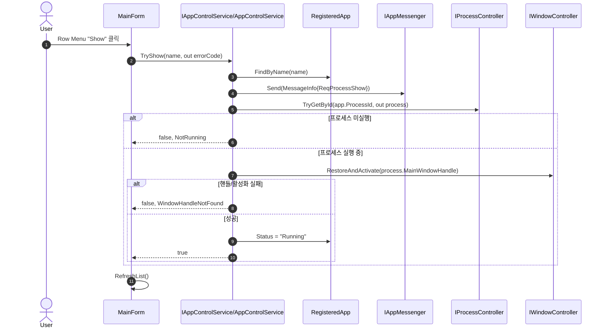
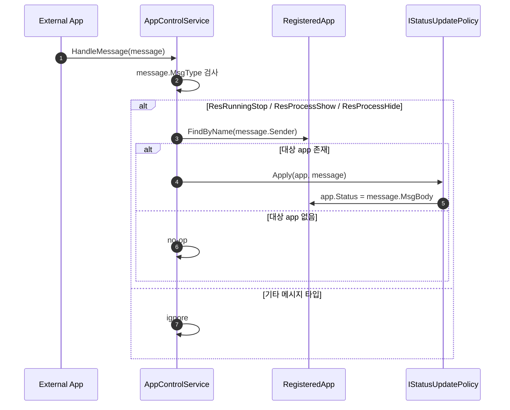
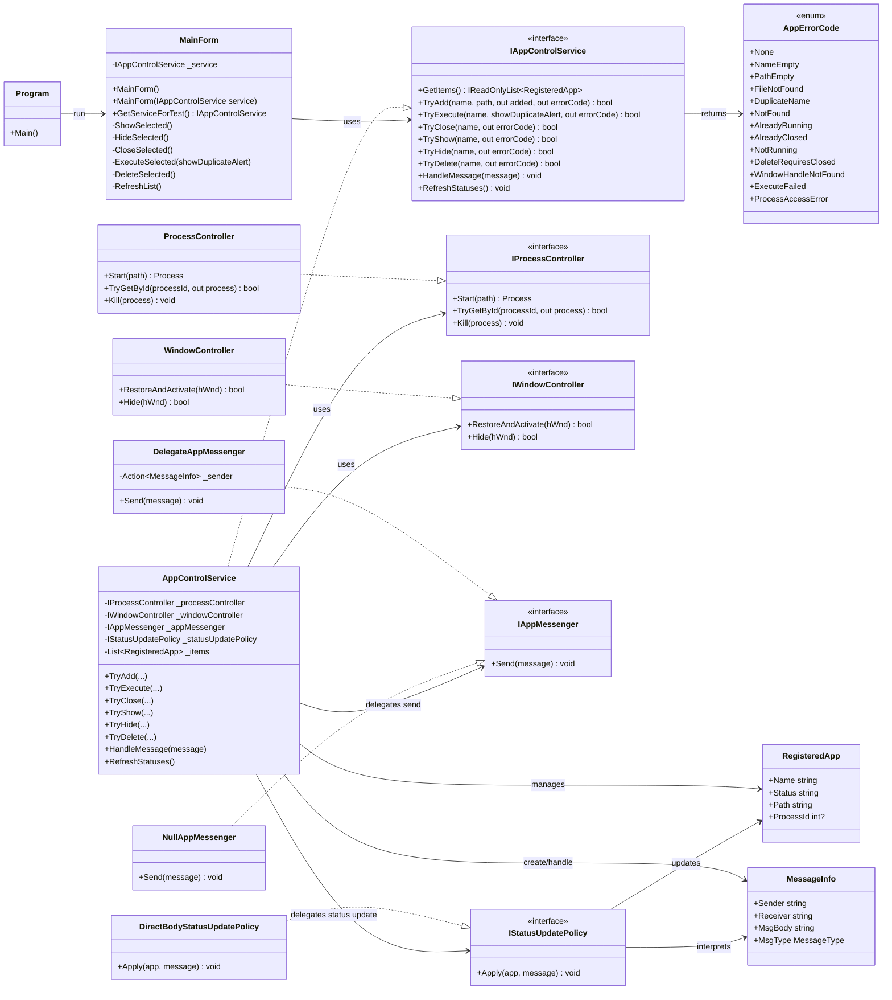

# EDAS_WCF Diagram

## Sequence Diagram

### Show 요청 흐름 (`MainForm.ShowSelected` -> `TryShow`)

```mermaid
sequenceDiagram
autonumber
actor User
participant UI as MainForm
participant S as IAppControlService/AppControlService
participant A as RegisteredApp
participant MSG as IAppMessenger
participant P as IProcessController
participant W as IWindowController

User->>UI: Row Menu "Show" 클릭
UI->>S: TryShow(name, out errorCode)
S->>A: FindByName(name)
S->>MSG: Send(MessageInfo{ReqProcessShow})
S->>P: TryGetById(app.ProcessId, out process)
alt 프로세스 미실행
    S-->>UI: false, NotRunning
else 프로세스 실행 중
    S->>W: RestoreAndActivate(process.MainWindowHandle)
    alt 핸들/활성화 실패
        S-->>UI: false, WindowHandleNotFound
    else 성공
        S->>A: Status = "Running"
        S-->>UI: true
    end
end
UI->>UI: RefreshList()
```

### 메시지 수신 상태 갱신 흐름 (`HandleMessage`)

```mermaid
sequenceDiagram
autonumber
participant Ext as External App
participant S as AppControlService
participant A as RegisteredApp
participant POL as IStatusUpdatePolicy

Ext->>S: HandleMessage(message)
S->>S: message.MsgType 검사
alt ResRunningStop / ResProcessShow / ResProcessHide
    S->>A: FindByName(message.Sender)
    alt 대상 app 존재
        S->>POL: Apply(app, message)
        POL->>A: app.Status = message.MsgBody
    else 대상 app 없음
        S->>S: no-op
    end
else 기타 메시지 타입
    S->>S: ignore
end
```

## Class Diagram

```mermaid
classDiagram
direction LR

class Program {
  +Main()
}

class MainForm {
  -IAppControlService _service
  +MainForm()
  +MainForm(IAppControlService service)
  +GetServiceForTest() IAppControlService
  -ShowSelected()
  -HideSelected()
  -CloseSelected()
  -ExecuteSelected(showDuplicateAlert)
  -DeleteSelected()
  -RefreshList()
}

class IAppControlService {
  <<interface>>
  +GetItems() IReadOnlyList~RegisteredApp~
  +TryAdd(name, path, out added, out errorCode) bool
  +TryExecute(name, showDuplicateAlert, out errorCode) bool
  +TryClose(name, out errorCode) bool
  +TryShow(name, out errorCode) bool
  +TryHide(name, out errorCode) bool
  +TryDelete(name, out errorCode) bool
  +HandleMessage(message) void
  +RefreshStatuses() void
}

class AppControlService {
  -IProcessController _processController
  -IWindowController _windowController
  -IAppMessenger _appMessenger
  -IStatusUpdatePolicy _statusUpdatePolicy
  -List~RegisteredApp~ _items
  +TryAdd(...)
  +TryExecute(...)
  +TryClose(...)
  +TryShow(...)
  +TryHide(...)
  +TryDelete(...)
  +HandleMessage(message)
  +RefreshStatuses()
}

class IProcessController {
  <<interface>>
  +Start(path) Process
  +TryGetById(processId, out process) bool
  +Kill(process) void
}

class ProcessController {
  +Start(path) Process
  +TryGetById(processId, out process) bool
  +Kill(process) void
}

class IWindowController {
  <<interface>>
  +RestoreAndActivate(hWnd) bool
  +Hide(hWnd) bool
}

class WindowController {
  +RestoreAndActivate(hWnd) bool
  +Hide(hWnd) bool
}

class IAppMessenger {
  <<interface>>
  +Send(message) void
}

class NullAppMessenger {
  +Send(message) void
}

class DelegateAppMessenger {
  -Action~MessageInfo~ _sender
  +Send(message) void
}

class IStatusUpdatePolicy {
  <<interface>>
  +Apply(app, message) void
}

class DirectBodyStatusUpdatePolicy {
  +Apply(app, message) void
}

class RegisteredApp {
  +Name string
  +Status string
  +Path string
  +ProcessId int?
}

class MessageInfo {
  +Sender string
  +Receiver string
  +MsgBody string
  +MsgType MessageType
}

class AppErrorCode {
  <<enum>>
  +None
  +NameEmpty
  +PathEmpty
  +FileNotFound
  +DuplicateName
  +NotFound
  +AlreadyRunning
  +AlreadyClosed
  +NotRunning
  +DeleteRequiresClosed
  +WindowHandleNotFound
  +ExecuteFailed
  +ProcessAccessError
}

Program --> MainForm : run
MainForm --> IAppControlService : uses
AppControlService ..|> IAppControlService

AppControlService --> IProcessController : uses
ProcessController ..|> IProcessController

AppControlService --> IWindowController : uses
WindowController ..|> IWindowController

AppControlService --> IAppMessenger : delegates send
NullAppMessenger ..|> IAppMessenger
DelegateAppMessenger ..|> IAppMessenger

AppControlService --> IStatusUpdatePolicy : delegates status update
DirectBodyStatusUpdatePolicy ..|> IStatusUpdatePolicy

IStatusUpdatePolicy --> RegisteredApp : updates
IStatusUpdatePolicy --> MessageInfo : interprets

AppControlService --> RegisteredApp : manages
AppControlService --> MessageInfo : create/handle
IAppControlService --> AppErrorCode : returns
```
