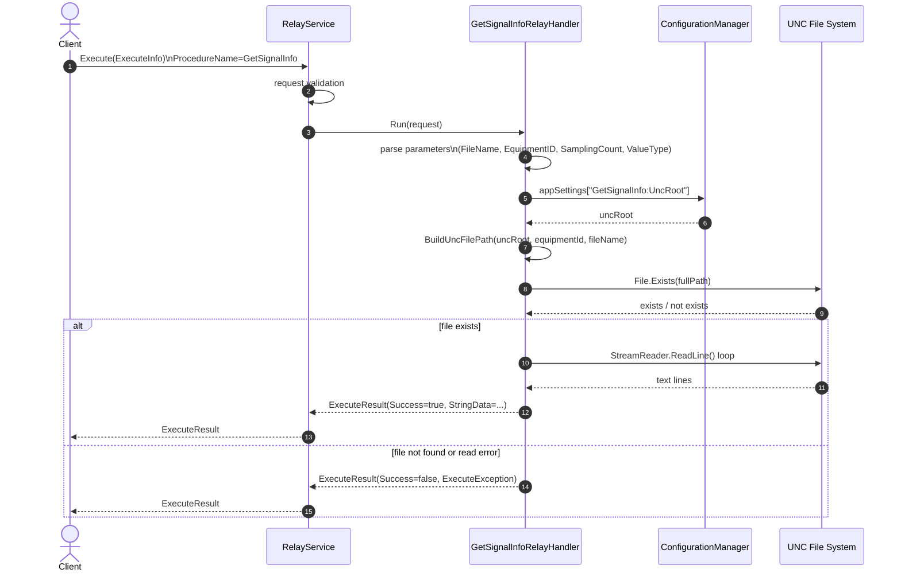
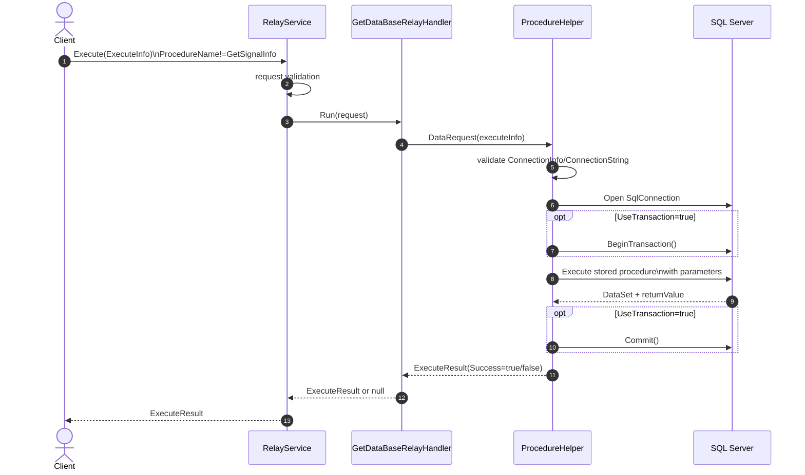
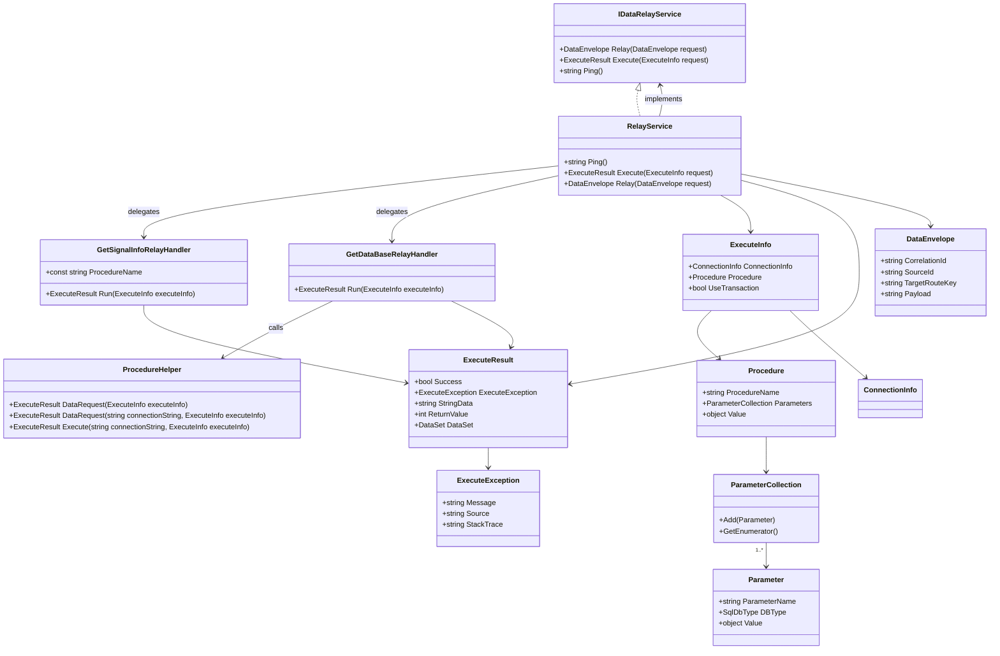

# EDAS_WCF Diagram

## Sequence Diagram - Execute (GetSignalInfo)

```mermaid
sequenceDiagram
    autonumber
    actor Client
    participant Service as RelayService
    participant Handler as GetSignalInfoRelayHandler
    participant Config as ConfigurationManager
    participant FS as UNC File System

    Client->>Service: Execute(ExecuteInfo)\nProcedureName=GetSignalInfo
    Service->>Service: request validation
    Service->>Handler: Run(request)
    Handler->>Handler: parse parameters\n(FileName, EquipmentID, SamplingCount, ValueType)
    Handler->>Config: appSettings["GetSignalInfo:UncRoot"]
    Config-->>Handler: uncRoot
    Handler->>Handler: BuildUncFilePath(uncRoot, equipmentId, fileName)
    Handler->>FS: File.Exists(fullPath)
    FS-->>Handler: exists / not exists

    alt file exists
        Handler->>FS: StreamReader.ReadLine() loop
        FS-->>Handler: text lines
        Handler-->>Service: ExecuteResult(Success=true, StringData=...)
        Service-->>Client: ExecuteResult
    else file not found or read error
        Handler-->>Service: ExecuteResult(Success=false, ExecuteException)
        Service-->>Client: ExecuteResult
    end
```

## Sequence Diagram - Execute (DB Procedure)

```mermaid
sequenceDiagram
    autonumber
    actor Client
    participant Service as RelayService
    participant DbHandler as GetDataBaseRelayHandler
    participant Helper as ProcedureHelper
    participant SQL as SQL Server

    Client->>Service: Execute(ExecuteInfo)\nProcedureName!=GetSignalInfo
    Service->>Service: request validation
    Service->>DbHandler: Run(request)
    DbHandler->>Helper: DataRequest(executeInfo)
    Helper->>Helper: validate ConnectionInfo/ConnectionString
    Helper->>SQL: Open SqlConnection
    opt UseTransaction=true
        Helper->>SQL: BeginTransaction()
    end
    Helper->>SQL: Execute stored procedure\nwith parameters
    SQL-->>Helper: DataSet + returnValue
    opt UseTransaction=true
        Helper->>SQL: Commit()
    end
    Helper-->>DbHandler: ExecuteResult(Success=true/false)
    DbHandler-->>Service: ExecuteResult or null
    Service-->>Client: ExecuteResult
```

## Class Diagram

```mermaid
classDiagram
    class IDataRelayService {
        +DataEnvelope Relay(DataEnvelope request)
        +ExecuteResult Execute(ExecuteInfo request)
        +string Ping()
    }

    class RelayService {
        +string Ping()
        +ExecuteResult Execute(ExecuteInfo request)
        +DataEnvelope Relay(DataEnvelope request)
    }

    class DataEnvelope {
        +string CorrelationId
        +string SourceId
        +string TargetRouteKey
        +string Payload
    }

    class ExecuteInfo {
        +ConnectionInfo ConnectionInfo
        +Procedure Procedure
        +bool UseTransaction
    }

    class Procedure {
        +string ProcedureName
        +ParameterCollection Parameters
        +object Value
    }

    class ParameterCollection {
        +Add(Parameter)
        +GetEnumerator()
    }

    class Parameter {
        +string ParameterName
        +SqlDbType DBType
        +object Value
    }

    class ExecuteResult {
        +bool Success
        +ExecuteException ExecuteException
        +string StringData
        +int ReturnValue
        +DataSet DataSet
    }

    class ExecuteException {
        +string Message
        +string Source
        +string StackTrace
    }

    class GetSignalInfoRelayHandler {
        +const string ProcedureName
        +ExecuteResult Run(ExecuteInfo executeInfo)
    }

    class GetDataBaseRelayHandler {
        +ExecuteResult Run(ExecuteInfo executeInfo)
    }

    class ProcedureHelper {
        +ExecuteResult DataRequest(ExecuteInfo executeInfo)
        +ExecuteResult DataRequest(string connectionString, ExecuteInfo executeInfo)
        +ExecuteResult Execute(string connectionString, ExecuteInfo executeInfo)
    }

    IDataRelayService <|.. RelayService
    RelayService --> IDataRelayService : implements
    RelayService --> GetSignalInfoRelayHandler : delegates
    RelayService --> GetDataBaseRelayHandler : delegates
    GetDataBaseRelayHandler --> ProcedureHelper : calls

    ExecuteInfo --> Procedure
    ExecuteInfo --> ConnectionInfo
    Procedure --> ParameterCollection
    ParameterCollection "1..*" --> Parameter
    RelayService --> ExecuteInfo
    RelayService --> ExecuteResult
    RelayService --> DataEnvelope
    GetSignalInfoRelayHandler --> ExecuteResult
    GetDataBaseRelayHandler --> ExecuteResult
    ExecuteResult --> ExecuteException
```

